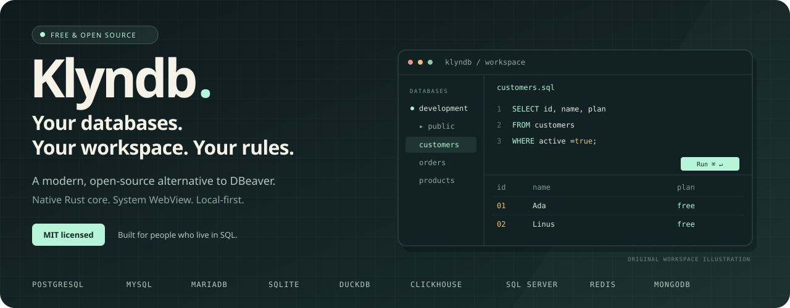
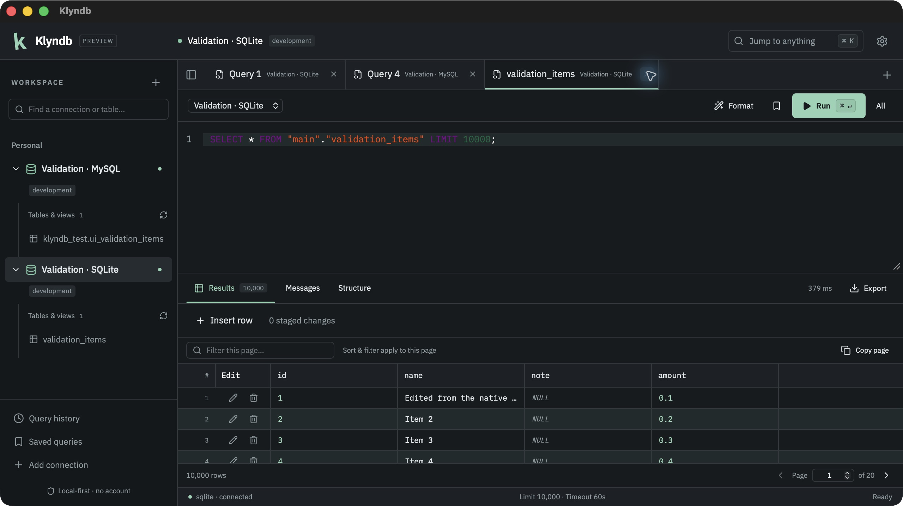

<p align="center">
  
</p>

<p align="center">
  <strong>🦀 A native database workbench. Free, open source, and yours.</strong><br />
  SQL tabs. Real databases. A workspace that stays on your machine.
</p>

<p align="center">
  <a href="https://github.com/OthmaneBlial/klyndb/stargazers"></a>
  <a href="LICENSE"></a>
  
  
  
</p>

<p align="center">
  <a href="https://othmaneblial.github.io/klyndb/">🌐 Website</a> ·
  <a href="https://othmaneblial.github.io/klyndb/docs.html">📖 Docs</a> ·
  <a href="#get-started">🚀 Get started</a> ·
  <a href="#features">✨ Features</a> ·
  <a href="docs/COMPATIBILITY.md">🗄️ Databases</a> ·
  <a href="ROADMAP.md">🧭 Roadmap</a> ·
  <a href="CONTRIBUTING.md">🤝 Contribute</a>
</p>

---

## ✨ Your daily database work, with less clutter

**Klyndb is a free, open-source alternative to DBeaver.** Connect to your databases, write SQL, browse tables and review edits in one focused desktop workspace. Built with **Rust + Tauri**, using your system WebView.

<table>
<tr>
<td width="33%"><h3>🦀 Native at the core</h3>Rust handles queries, streaming, cancellation and files.</td>
<td width="33%"><h3>🔒 Your data stays yours</h3>OS keychain credentials. Local workspace. No account required.</td>
<td width="33%"><h3>⌨️ Built around SQL</h3>Multiple tabs, a command palette and keyboard shortcuts.</td>
</tr>
</table>

**No Electron. No account. No mandatory cloud. No query telemetry.**

<p align="center">
  
  <br /><sub>Captured from the native macOS app with 10,000 synthetic test records in a local validation database.</sub>
</p>

<a id="features"></a>

## 🛠️ What you can do today

| Your workflow | Klyndb |
| --- | --- |
| **🔌 Connect** | PostgreSQL, MySQL, MariaDB and SQLite; connection testing, saved connections, groups, favorites and environment labels. |
| **🧭 Explore** | Tables and views, columns, primary keys, indexes, foreign keys, constraints, user triggers and available table DDL. |
| **⌨️ Write SQL** | Multiple tabs, syntax highlighting, dialect-aware formatting, schema completion and statement/selection/batch execution. |
| **📊 Work with results** | Streamed results, a virtualized grid, server-side table filters/sort/pages, column layout and cell inspection. [Browse guide](docs/TABLE_BROWSING.md). |
| **✍️ Edit data** | Staged SQLite/PostgreSQL and MySQL/MariaDB InnoDB inserts, updates and deletes; review, bound values and optimistic conflicts. |
| **🔍 Understand queries** | Native estimated plans, collapsible trees, raw output, server messages and confirmed runtime analysis where supported. [Plan guide](docs/EXPLAIN.md). |
| **🛡️ Stay in control** | Cancellation, timeouts, read-only connections, destructive-query confirmations and actual transaction visibility. |
| **🗺️ Understand relationships** | Native foreign keys, composite keys, pan/zoom, saved layouts and SVG export. [Diagram guide](docs/DIAGRAMS.md). |
| **📥 Import CSV** | Native file picker, preview, column mapping, streaming inserts and progress/cancel. [Import guide](docs/IMPORTS.md). |
| **📤 Export** | CSV, typed JSON/JSONL, SQL INSERT and Markdown through native save dialogs. |
| **💾 Keep your workspace** | Restored workspace, SQL history, saved/favorite queries, theme settings and a command palette. |

Server passwords stay in the **OS keychain**. TLS verification is enabled by default, with optional [custom CA certificates](docs/TLS.md) for private servers. Your queries and schemas stay local. Read [SECURITY.md](SECURITY.md) for the exact security model and local-history behavior.

## 🗄️ Four databases. One workspace.

| Database | Queries & schema | Staged grid edits | Verified against |
| --- | --- | --- | --- |
| PostgreSQL | ✓ | ✓ | PostgreSQL 16 |
| MySQL | ✓ | ✓ · InnoDB | MySQL 8.4.11 |
| MariaDB | ✓ | ✓ · InnoDB | MariaDB 13.0.2 |
| SQLite | ✓ | ✓ | Real SQLite files |

These are implemented engines, tested against actual databases. See the [compatibility matrix](docs/COMPATIBILITY.md) for type, export and workflow limits.

**Development preview:** Klyndb is already runnable from source. JSON/SQL imports, SSH tunnels, additional drivers and native release packages are in progress. It does not yet cover every DBeaver workflow. The [roadmap](ROADMAP.md) tracks the next working slices and is updated with each meaningful change.

## ⚡ Rust does the heavy lifting

Database work belongs in Rust: connections, query execution, cancellation, result paging and exports. React handles the interface. Drivers initialize only when you connect; opening the app does not open database sessions.

Large results go to a bounded, temporary disk spool. The interface holds a **500-row page**, rather than copying an entire result into browser memory.

A reproducible SQLite backend baseline retained **1 million rows** at a median **352,393 rows/second**, with **13.50 MiB peak backend-process RSS** on the recorded Apple M2 machine. This measures the backend only, not total desktop memory or a comparison with DBeaver. See the [benchmark methodology and raw samples](benchmarks/README.md). Desktop startup, memory and scrolling measurements are on the roadmap.

<a id="get-started"></a>

## 🚀 Get started

You need **Rust stable**, **Node.js 22.12+** and the [Tauri platform prerequisites](https://v2.tauri.app/start/prerequisites/). Linux also needs Secret Service/DBus development libraries; remembered passwords require an unlocked OS keychain.

```sh
git clone https://github.com/OthmaneBlial/klyndb.git
cd klyndb/apps/desktop
npm ci
npm run tauri dev
```

Then create a connection, open a table or SQL tab, and run a real query.

| Shortcut | Action |
| --- | --- |
| `Cmd/Ctrl + Enter` | Run the selected SQL or current statement |
| `Cmd/Ctrl + K` | Open the command palette |
| `Shift + Cmd/Ctrl + F` | Format SQL |
| `Cmd/Ctrl + S` | Save a query |

Build a native package with `npm run tauri build`. Platform targets are macOS, Windows and Linux. Current native workflows are verified on macOS; current driver/package verification on Windows and Linux remains pending. Public downloadable releases are not available yet. macOS signing and notarization require Apple credentials.

## 🧪 Local checks

```sh
./scripts/check.sh
```

Install the audit tools with `cargo install cargo-audit cargo-deny --locked`. The script runs locked frontend installation, lint, typecheck, tests, production build, Rust formatting/Clippy/tests, a native debug build and dependency/license audits.

Set `KLYNDB_TEST_POSTGRES_URL` or `KLYNDB_TEST_MYSQL_URL` to run the real-server contracts against **disposable local databases**. The MySQL contract runs on either MySQL or MariaDB; verify both separately. Never use production databases for integration tests.

**GitHub Actions is disabled by owner instruction. All current CI checks run locally.**

## ⭐ Help shape the alternative

Try Klyndb on a development database. Report a reproducible issue, request a database workflow, or contribute a complete driver or UI improvement. If you want a free, open-source DBeaver alternative to keep growing, **[give Klyndb a star](https://github.com/OthmaneBlial/klyndb)**. Stars help other developers find the project.

<p align="center">
  <a href="https://github.com/OthmaneBlial/klyndb"></a>
</p>

**Found a bug?** [Open an issue](https://github.com/OthmaneBlial/klyndb/issues). **Missing a workflow?** Tell us what you need. **Want to build it?** Start with [CONTRIBUTING.md](CONTRIBUTING.md).

[Contributing](CONTRIBUTING.md) · [Architecture](ARCHITECTURE.md) · [Roadmap](ROADMAP.md) · [Validation evidence](docs/VALIDATION.md) · [Full product scope](docs/PRODUCT_SPEC.md)

**MIT licensed.** Original code and branding. Beekeeper Studio is a functional reference; no Beekeeper source or assets are bundled. Third-party dependencies retain their own licenses: [notices and provenance](THIRD_PARTY_NOTICES.md).
