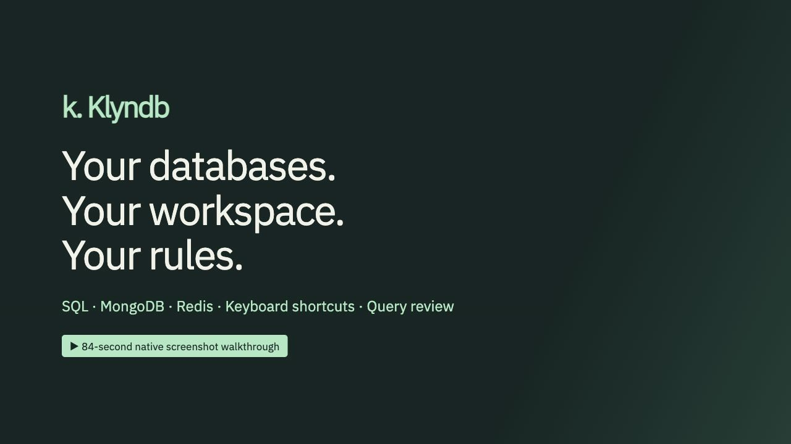
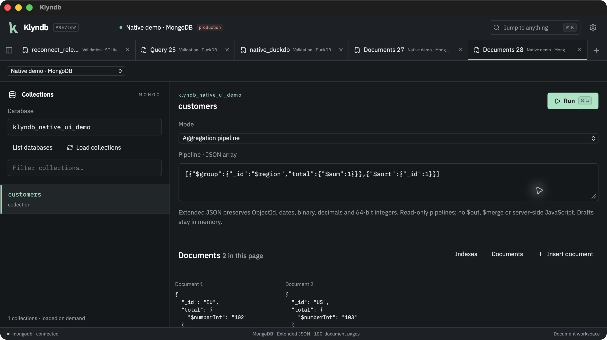
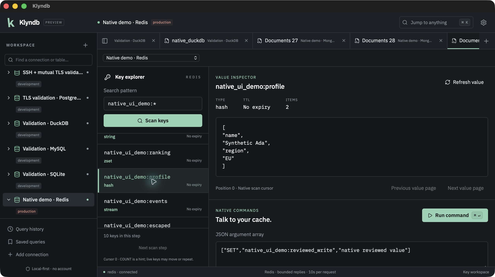
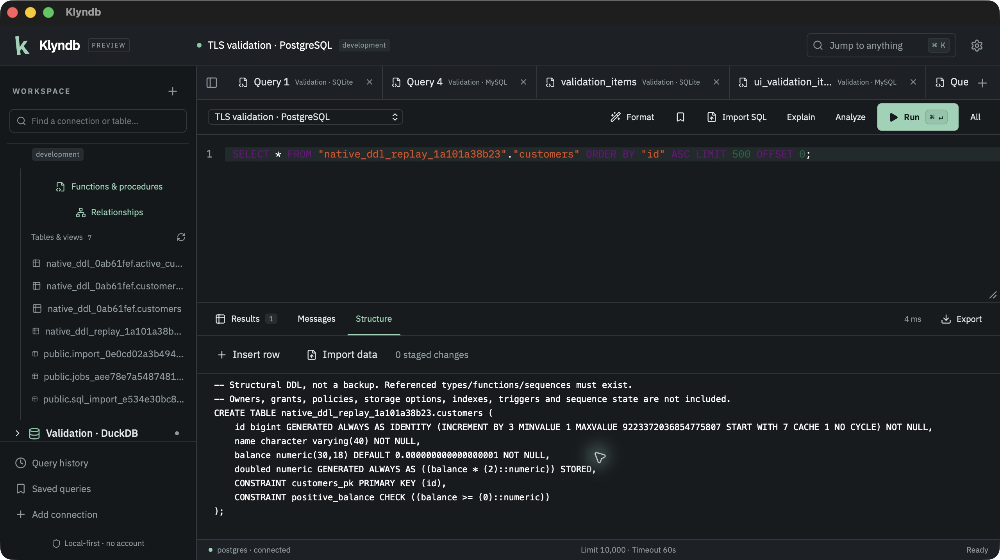
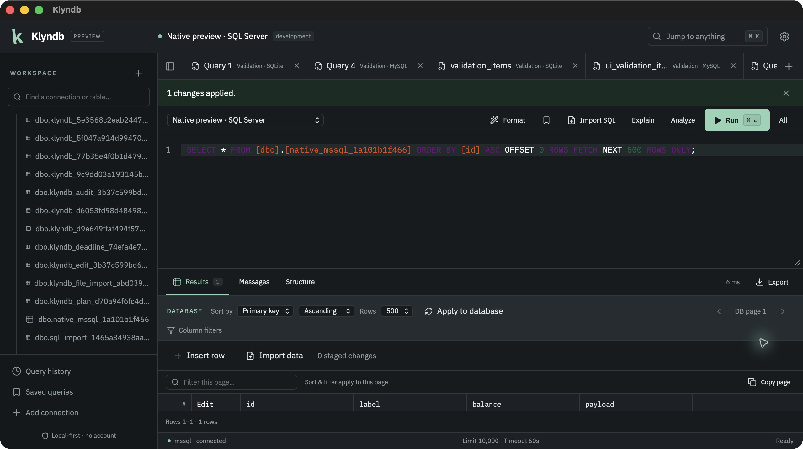
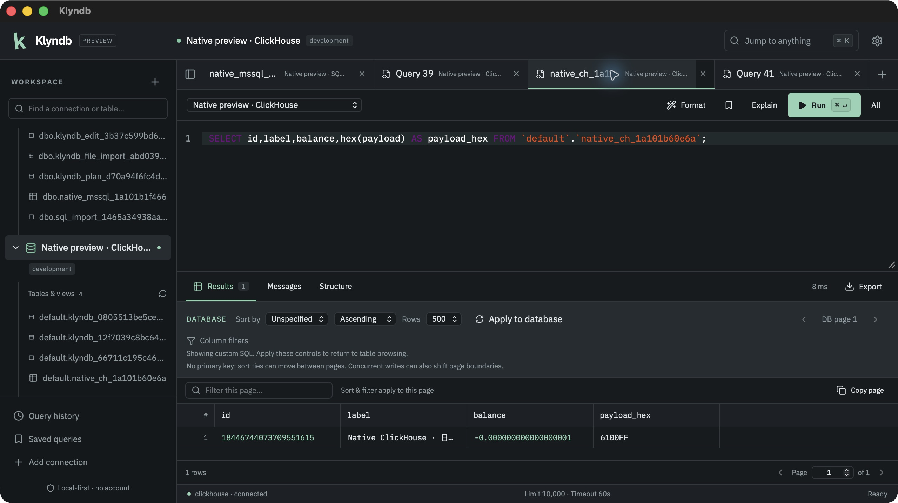

<p align="center">
  
</p>

<p align="center">
  <strong>🦀 A native database workbench. Free, open source, and yours.</strong><br />
  SQL tabs. Redis keys. MongoDB documents. A workspace that stays on your machine.
</p>

<p align="center">
  <a href="https://github.com/OthmaneBlial/klyndb/stargazers"></a>
  <a href="LICENSE"></a>
  
  
  
</p>

<p align="center">
  <a href="https://othmaneblial.github.io/klyndb/">🌐 Website</a> ·
  <a href="https://othmaneblial.github.io/klyndb/docs.html">📖 Docs</a> ·
  <a href="#get-started">🚀 Get started</a> ·
  <a href="#demo">🎬 Demo</a> ·
  <a href="#features">✨ Features</a> ·
  <a href="docs/COMPATIBILITY.md">🗄️ Databases</a> ·
  <a href="ROADMAP.md">🧭 Roadmap</a> ·
  <a href="CONTRIBUTING.md">🤝 Contribute</a>
</p>

---

## ✨ Your daily database work, with less clutter

**Klyndb is a free, open-source alternative to DBeaver.** Connect to your databases, write SQL, browse tables and review edits in one focused desktop workspace. Built with **Rust + Tauri**, using your system WebView.

<table>
<tr>
<td width="33%"><h3>🦀 Native at the core</h3>Rust handles queries, streaming, cancellation and files.</td>
<td width="33%"><h3>🔒 Your data stays yours</h3>OS keychain credentials. Local workspace. No account required.</td>
<td width="33%"><h3>⌨️ Built around SQL</h3>Multiple tabs, a command palette and keyboard shortcuts.</td>
</tr>
</table>

**No Electron. No account. No mandatory cloud. No query telemetry.**

<a id="demo"></a>

## 🎬 Meet your next database client

[](https://othmaneblial.github.io/klyndb/#demo)

<p align="center">
  <a href="https://othmaneblial.github.io/klyndb/#demo"><strong>▶ Watch the 64-second demo</strong></a> ·
  <a href="https://othmaneblial.github.io/klyndb/assets/klyndb-preview-demo.mp4">Download MP4</a> ·
  <a href="docs/DEMO.md">Scene guide</a>
</p>

A captioned screenshot tour of **SQL tabs and results**, **MongoDB filters and aggregation**, **Redis key inspection**, and **production-write review**. **All SQL, MongoDB and Redis scenes are real native macOS captures**, using synthetic data and real database requests. Redis now shows the native key explorer, original bytes and production-write review.

<details>
<summary>📸 See the native macOS workspace</summary>

<p align="center">
  
  <br /><sub>Captured from the native macOS app with 10,000 synthetic test records in a local validation database.</sub>
</p>

<p align="center">
  
  <br /><sub>Real MongoDB aggregation in the native source debug app. Synthetic records only.</sub>
</p>

<p align="center">
  
  <br /><sub>Real Redis keys and hash inspection in the native source debug app. Synthetic records only.</sub>
</p>

<p align="center">
  
  <br /><sub>PostgreSQL Structure, replayed through the native editor and inspected again. Synthetic data in a source debug build.</sub>
</p>

<p align="center">
  
  <br /><sub>SQL Server: reviewed edits over verified TLS. Synthetic data in a source debug build.</sub>
</p>

<p align="center">
  
  <br /><sub>ClickHouse: precise SQL results, native plans, CSV export and cancellation. Synthetic data in a source debug build.</sub>
</p>
</details>

<a id="features"></a>

## 🛠️ What you can do today

| Your workflow | Klyndb |
| --- | --- |
| **🍃 Explore MongoDB** | Source builds add native JSON filters, read-only aggregation pipelines, paged documents, JSON/tree inspection, indexes and reviewed insert/replace/delete with concurrent-change guards. Query drafts and replies stay with their tab in memory, including replies arriving after a tab switch. [MongoDB guide](docs/MONGODB.md). |
| **🔑 Explore Redis** | Source builds add native key search, types/TTL, bounded string/hash/list/set/sorted-set/stream inspection and native data commands in a dedicated workspace; production confirmations and read-only guards. Command drafts and explorer replies stay with their tab in memory, including replies arriving after a tab switch. |
| **🔌 Connect** | PostgreSQL, MySQL, MariaDB and SQLite, plus [DuckDB](docs/DUCKDB.md), [ClickHouse](docs/CLICKHOUSE.md), [SQL Server](docs/SQLSERVER.md), [Redis](docs/REDIS.md) and [MongoDB](docs/MONGODB.md) in source builds; connection testing, confirmed session reconnect, saved connections, groups, favorites and environment labels. |
| **🧭 Explore** | Tables and views, columns, primary keys, indexes, foreign keys, constraints and triggers where supported. Source builds add [PostgreSQL structural DDL, materialized views and table statistics](docs/POSTGRES.md). [Engine matrix](docs/COMPATIBILITY.md). |
| **ƒ Inspect routines** | PostgreSQL, MySQL, MariaDB and SQL Server source builds: search and page routines, inspect native definitions and open them in an SQL tab. |
| **⌨️ Write SQL** | Multiple tabs, syntax highlighting, dialect-aware formatting, schema-qualified table and lazy alias-column completion, source-build [CTE/subquery column suggestions](docs/SQL_COMPLETION.md), statement/selection/batch execution, and source-build navigation to reported SQL error positions. |
| **📊 Work with results** | Streamed results, a virtualized grid, server-side table filters/sort/pages, column layout and cell inspection. [Browse guide](docs/TABLE_BROWSING.md). |
| **✍️ Edit data** | Staged inserts, updates and deletes on SQLite/PostgreSQL, MySQL/MariaDB InnoDB, DuckDB scalar base tables and SQL Server disk-based tables (DuckDB/SQL Server in source builds); review, bound values and optimistic conflicts. |
| **🔍 Understand queries** | Native estimated plans, collapsible trees, raw output, server messages and confirmed runtime analysis, including ClickHouse source-build operator/index plans and SQL Server source-build rows/execution counts. [Plan guide](docs/EXPLAIN.md). |
| **🛡️ Stay in control** | Cancellation, configurable connection/query timeouts, read-only connections, destructive-query confirmations and actual transaction visibility. |
| **🗺️ Understand relationships** | Native foreign keys, composite keys, pan/zoom, saved layouts and SVG export on SQLite/PostgreSQL/MySQL/MariaDB, DuckDB and SQL Server source builds. [Diagram guide](docs/DIAGRAMS.md). |
| **📥 Import CSV / JSON / SQL** | Native file pickers, mapped CSV/JSON inserts on six relational engines (DuckDB/SQL Server in source builds), and SQL scripts on the same engines with review, transaction visibility and progress/cancel; SQL Server preserves native GO batches. [Import guide](docs/IMPORTS.md). |
| **📤 Export** | CSV, typed JSON/JSONL, SQL INSERT and Markdown through native save dialogs. |
| **💾 Keep your workspace** | Restored workspace, SQL history, saved/favorite queries, theme settings and a command palette. Source builds add opt-in MongoDB/Redis draft restoration after restart, without automatic execution. |

Server passwords stay in the **OS keychain**. TLS verification is enabled by default, with optional [CA files and client certificates](docs/TLS.md) for private servers, plus [SSH tunnels with verified host keys](docs/SSH.md). Your queries and schemas stay local. Read [SECURITY.md](SECURITY.md) for the exact security model and local-history behavior.

## 🗄️ Nine databases. One workspace.

| Database | Queries & schema | Staged grid edits | Verified against |
| --- | --- | --- | --- |
| PostgreSQL | ✓ | ✓ | PostgreSQL 16 |
| MySQL | ✓ | ✓ · InnoDB | MySQL 8.4.11 |
| MariaDB | ✓ | ✓ · InnoDB | MariaDB 13.0.2 |
| SQLite | ✓ | ✓ | Real SQLite files |
| DuckDB | ✓ | ✓ · scalar base tables; finish SQL transactions first | Embedded DuckDB 1.5.6 · native macOS query workflow and durable Preview 2 reviewed edit; source import/ER contracts |
| ClickHouse | ✓ | Pending | ClickHouse 26.3.39.7 · real backend contracts and native macOS query/plan/export/cancel checks |
| SQL Server | ✓ | ✓ · disk-based base tables | SQL Server 2022 CU27 · real backend contracts and native macOS TLS/query/catalog/edit/plan/import/export/cancel checks |
| Redis | Native keys, TTLs, six value types and data commands | Native data commands; production/read-only guards | Redis 7.4.11 · real backend/TLS/mTLS contracts and native macOS source UI acceptance |
| MongoDB | Native documents, JSON filters, aggregation, indexes and JSON/tree views | Reviewed single-document writes; production/read-only/conflict guards | MongoDB 8.0.32 · real backend/TLS/mTLS contracts; macOS debug browse/aggregation/CRUD verified |

These are implemented engines, tested against actual databases. See the [compatibility matrix](docs/COMPATIBILITY.md) for type, export and workflow limits.

The downloadable Preview 2 includes all nine engines. Its exact-package acceptance covers the workflow slices in the [release guide](docs/RELEASES.md); broader platform and feature acceptance remain pending. See the [DuckDB](docs/DUCKDB.md), [ClickHouse](docs/CLICKHOUSE.md), [SQL Server](docs/SQLSERVER.md), [Redis](docs/REDIS.md) and [MongoDB](docs/MONGODB.md) guides for setup and current limits.

**Development preview:** [Download Preview 2 for macOS Apple Silicon](https://github.com/OthmaneBlial/klyndb/releases/tag/v0.1.0-preview.2), or build from source. Additional drivers and Windows/Linux packages are in progress. It does not yet cover every DBeaver workflow. The [roadmap](ROADMAP.md) tracks the next working slices and is updated with each meaningful change.

## ⚡ Rust does the heavy lifting

Database work belongs in Rust: connections, query execution, cancellation, result paging and exports. React handles the interface. Drivers initialize only when you connect; opening the app does not open database sessions.

Large results go to a bounded, temporary disk spool. The interface holds a **500-row page**, rather than copying an entire result into browser memory.

A reproducible SQLite backend baseline retained **1 million rows** at a median **352,393 rows/second**, with **13.50 MiB peak backend-process RSS** on the recorded Apple M2 machine. This measures the backend only, not total desktop memory or a comparison with DBeaver. See the [benchmark methodology and raw samples](benchmarks/README.md). Desktop startup, memory and scrolling measurements are on the roadmap.

<a id="get-started"></a>

## 🚀 Get started

**macOS Apple Silicon:** [Download the DMG or app ZIP](https://github.com/OthmaneBlial/klyndb/releases/tag/v0.1.0-preview.2). Preview 2 is ad-hoc signed, without Apple notarization; macOS may prevent opening it. The release includes checksums and exact-package validation evidence. Native acceptance covers the complete SQLite preview workflow and additional PostgreSQL, MySQL, DuckDB, SQL Server, ClickHouse, MongoDB and Redis slices on macOS 26.6 arm64. MariaDB native and other platform checks remain pending. See the [release guide](docs/RELEASES.md).

**Build from source:**

You need **Rust stable**, **Node.js 22.12+** and the [Tauri platform prerequisites](https://v2.tauri.app/start/prerequisites/). Linux also needs Secret Service/DBus development libraries; remembered passwords require an unlocked OS keychain.

```sh
git clone https://github.com/OthmaneBlial/klyndb.git
cd klyndb/apps/desktop
npm ci
npm run tauri dev
```

Then create a connection, open a table or SQL tab, and run a real query.

Current source builds add [searchable saved queries and history](docs/QUERY_LIBRARY.md), with connection/favorite/failed-run filters and exact history-to-saved-query copies. Preview 2 retains the earlier library.

| Shortcut | Action |
| --- | --- |
| `Cmd/Ctrl + Enter` | Run the selected SQL or current statement |
| `Cmd/Ctrl + K` | Open the command palette |
| `Shift + Cmd/Ctrl + F` | Format SQL |
| `Cmd/Ctrl + S` | Save a query |

Build a native package with `npm run tauri build`. Platform targets are macOS, Windows and Linux. Current native workflows are verified on macOS; current driver/package verification on Windows and Linux remains pending. Preview 2 is available for macOS Apple Silicon; other platform downloads remain pending. macOS signing and notarization require Apple credentials. The [local release guide](docs/RELEASES.md) documents the optimized macOS DMG/ZIP candidate builder and acceptance checks.

## 🧪 Local checks

```sh
./scripts/check.sh
```

Install the audit tools with `cargo install cargo-audit cargo-deny --locked`. The script runs locked frontend installation, lint, typecheck, tests, production build, Rust formatting/Clippy/tests, a native debug build and dependency/license audits.

Set `KLYNDB_TEST_POSTGRES_URL` or `KLYNDB_TEST_MYSQL_URL` to run the real-server and delayed-handshake contracts against **disposable local databases**. The MySQL contract runs on either MySQL or MariaDB; verify both separately. `KLYNDB_TEST_MARIADB_URL` additionally runs MariaDB delayed-handshake coverage. For native ClickHouse TCP/TLS contracts, use the disposable fixture variables in [the ClickHouse guide](docs/CLICKHOUSE.md). For Redis, set `KLYNDB_TEST_REDIS_URL`, `KLYNDB_TEST_REDIS_PASSWORD` and `KLYNDB_TEST_REDIS_READONLY_PASSWORD` for separate writable/read-only ACL fixture users; TLS/mTLS contracts additionally use `KLYNDB_TEST_TLS_REDIS_URL`, `KLYNDB_TEST_MTLS_REDIS_URL` and `KLYNDB_TEST_TLS_CERT_DIR`. For MongoDB, set `KLYNDB_TEST_MONGODB_URL`, `KLYNDB_TEST_MONGODB_PASSWORD` and `KLYNDB_TEST_MONGODB_READONLY_PASSWORD`; see [fixture and TLS variables](docs/MONGODB.md#validation-and-limits). Never use production databases for integration tests.

**GitHub Actions is disabled by owner instruction. All current CI checks run locally.**

## ⭐ Help shape the alternative

Try Klyndb on a development database. Report a reproducible issue, request a database workflow, or contribute a complete driver or UI improvement. If you want a free, open-source DBeaver alternative to keep growing, **[give Klyndb a star](https://github.com/OthmaneBlial/klyndb)**. Stars help other developers find the project.

<p align="center">
  <a href="https://github.com/OthmaneBlial/klyndb"></a>
</p>

**Found a bug?** [Open an issue](https://github.com/OthmaneBlial/klyndb/issues). **Missing a workflow?** Tell us what you need. **Want to build it?** Start with [CONTRIBUTING.md](CONTRIBUTING.md).

[Contributing](CONTRIBUTING.md) · [Architecture](ARCHITECTURE.md) · [Roadmap](ROADMAP.md) · [Validation evidence](docs/VALIDATION.md) · [Full product scope](docs/PRODUCT_SPEC.md)

**MIT licensed.** Original code and branding. Beekeeper Studio is a functional reference; no Beekeeper source or assets are bundled. Third-party dependencies retain their own licenses: [notices and provenance](THIRD_PARTY_NOTICES.md).
