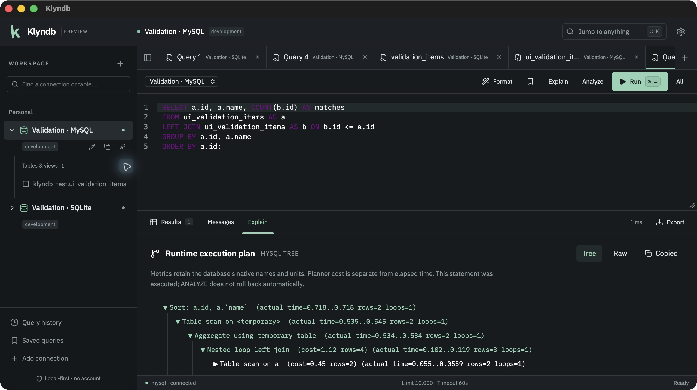

# Execution plans

Choose **Explain** for the current statement or selected SQL. It asks the database for an estimated plan. Choose **Analyze** to collect runtime statistics: the confirmation displays the exact SQL, connection and environment before execution. Analyze can write data or cause side effects. It does not roll back automatically; a transaction you opened remains yours to COMMIT or ROLLBACK.

| Engine | Estimated plan | Runtime plan |
| --- | --- | --- |
| PostgreSQL | EXPLAIN FORMAT JSON | ANALYZE + BUFFERS; supported native statements, including writes |
| MySQL | EXPLAIN FORMAT JSON | FORMAT TREE for read-only SELECT queries; server 8.0.18+ |
| MariaDB | EXPLAIN FORMAT JSON | ANALYZE FORMAT JSON; supported native statements, including writes; server 10.1+ |
| SQLite | EXPLAIN QUERY PLAN | No native runtime Analyze metrics |
| SQL Server (source builds after Preview 1) | SHOWPLAN_ALL, non-executing native operator rows | STATISTICS PROFILE; actual Rows/Executes, including confirmed writes |
| DuckDB (source builds after Preview 1) | EXPLAIN (FORMAT JSON), physical plan | EXPLAIN (ANALYZE, FORMAT JSON); native operators and runtime metrics, including writes |

The **Explain** result tab offers a collapsible tree, original server fields, **Raw** output and **Copy raw**. Timings, costs, rows, loops and buffer statistics appear when the server reports them. Names and units remain native; planner cost is separate from measured time. MySQL/MariaDB server messages are captured immediately with SHOW WARNINGS. The duration in the results toolbar includes client processing and transport.

PostgreSQL planning/execution times are milliseconds; actual node times and rows are averages per loop. MySQL TREE actual times are milliseconds averaged per loop. MariaDB's fields ending in `_ms` report milliseconds. DuckDB [`latency` and `operator_timing`](https://duckdb.org/docs/current/dev/metrics) are seconds; parallel operator timings cannot be summed to obtain elapsed time. SQL Server PROFILE reports actual operator rows and execution counts; its CPU/I/O/subtree costs remain optimizer estimates, and it does not provide per-operator runtime timings. These are database measurements, not Klyndb performance benchmarks.

Captured from the packaged macOS debug app with synthetic validation data. The displayed measurements belong to this test query and vary between runs.

The regular **Results** view and export dialog retain the native result sets. Plans share the ordinary query timeout and Cancel action. Failed or cancelled execution never produces a successful plan view. Server syntax/version limitations remain visible as errors.

Explain accepts exactly one statement or selection, without an existing EXPLAIN prefix. Read-only connections support estimated SELECT plans; PostgreSQL and SQLite also permit estimated DML, while MySQL/MariaDB can reject DML planning inside a native read-only transaction. DuckDB read-only files permit estimated SELECT plans but can reject estimated DML. SQL Server permits non-executing SELECT/DML plans through its controlled native SHOWPLAN action; server permissions still apply. Runtime profiling retains bounded data results and drains surplus rows before collecting the last native profile table. Missing native profiles are reported explicitly, with execution-completed/write-verification guidance. Existing profiling settings must be disabled first. Its history records native requests with GO separators; the editor now supports those batch boundaries. Select the original statement and use Explain/Analyze for the guarded plan workflow. [The SQL Server guide](SQLSERVER.md) describes cleanup, permissions and remaining native desktop checks. Analyze is disabled on read-only connections. MySQL's simple UPDATE can accept EXPLAIN ANALYZE while returning only an estimate; the Analyze button therefore rejects writes rather than labeling that output as runtime statistics. Wider MySQL runtime DML remains unverified.

Tree conversion is bounded to 4 MiB of native plan/messages, 5,000 nodes, 64 levels and an 8 MiB serialized IPC response. Oversized or malformed plans fail explicitly; retained raw result sets remain available within the ordinary result/export limits. No graphical plan visualization is claimed.

Native behavior references: [PostgreSQL EXPLAIN](https://www.postgresql.org/docs/current/sql-explain.html), [MySQL EXPLAIN](https://dev.mysql.com/doc/refman/8.4/en/explain.html), [MariaDB ANALYZE](https://mariadb.com/docs/server/reference/sql-statements/administrative-sql-statements/analyze-and-explain-statements/analyze-statement), [SQLite QUERY PLAN](https://www.sqlite.org/eqp.html), [DuckDB profiling](https://duckdb.org/docs/current/sql/statements/profiling). Implementation is original.
